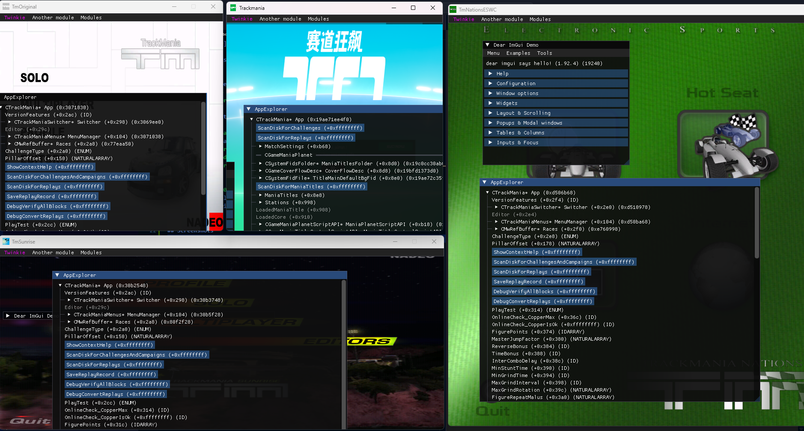

 

    

A work-in-progress cross-game fork of Twinkie for TM1.0, TMS, TMSX, TMO, TMNESWC, and TMCN.

## Features (currently implemented)
- **Automatic** GitHub release and versioning
- **Settings** and preferences management
- **Window resize patch** for older Trackmania games. *(still WIP)*
- A **nod explorer** for viewing game classes
- Support for **Trackmania coloring syntax in ImGui**
- **Discord Rich Presence** integration

## Features (yet to be made)
- On-the-fly **module import** for C++ modules
- Basic **Angelscript scripting** support for modules

## Contribute
You are welcome to contribute to this project.

## Notes
1. **TMS** is still **not supported**.
2. There is no release so far, you will have to build it on your own
3. If you want TwinkieX to be injected on game boot, you will have to do that yourself.

## Screenshots

## Support
There aren't any financial ways you can support TwinkieTweaks with, but we will be happy with a star!
